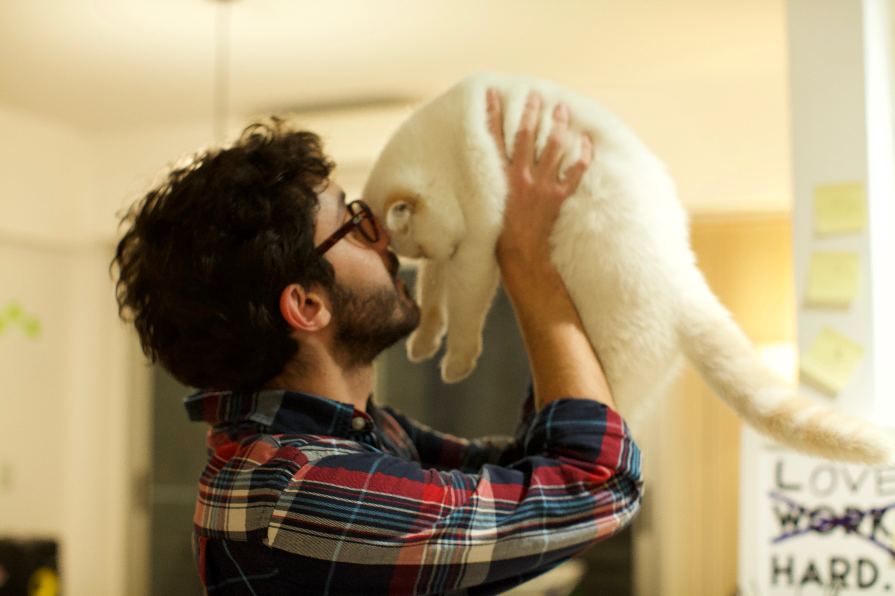

## Hi there, thank you for stopping by!

My name is Diego Peralta, I’m a self-taught web developer and entrepreneur from South America. I was born in a beautiful day on the summer of January 1990 in [Bahia Blanca](https://en.wikipedia.org/wiki/Bah%C3%ADa_Blanca) 🇦🇷. I'm the human of the cute cat you can see in the picture above. Her name is [Melania Teodora](https://instagram.com/melaisntamused). And we're both living in [Berlin](https://en.wikipedia.org/wiki/Berlin) 🇩🇪.

I’ve dreamed about building things on the Internet since the first time I heard the [old dial-up modem sound](https://www.youtube.com/watch?v=gsNaR6FRuO0) next to my computer, back in 1998. Later on, while still being in high school I learned enough web programming languages like HTML, CSS, and PHP to start developing websites for local businesses. 

Early in my career, I worked for companies that were offering remote job opportunities on different outsourcing platforms, mostly from North America and Europe. In those years, I coded a wide range of applications and websites. During that period I also learned how to lead teams to deliver kick-ass and award-winning products.

In September 2010 I founded [Pixel2HTML](https://pixel2html.com), a remote-first web development company. Since then our team helped hundred of _design agencies_, _tech startups_, and _businesses_ listed on the Fortune 500 to bring their ideas to the digital world.

### Want to contact me?

I’m happy to chat about the things I learned along my way! Send me an email to [hi@diego.earth](mailto:hi@diego.earth). Also, you can find me on [Github](https://github.com/spacecowb0y), [LinkedIn](https://ar.linkedin.com/in/dperalta), [Last.fm](https://last.fm/user/diego_ar) and [Goodreads](https://www.goodreads.com/user/show/46795449-diego-peralta).

Thank you for reading, 
Diego