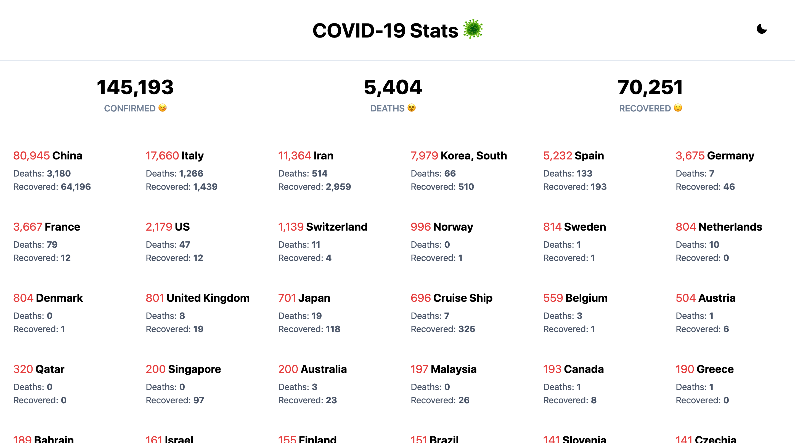
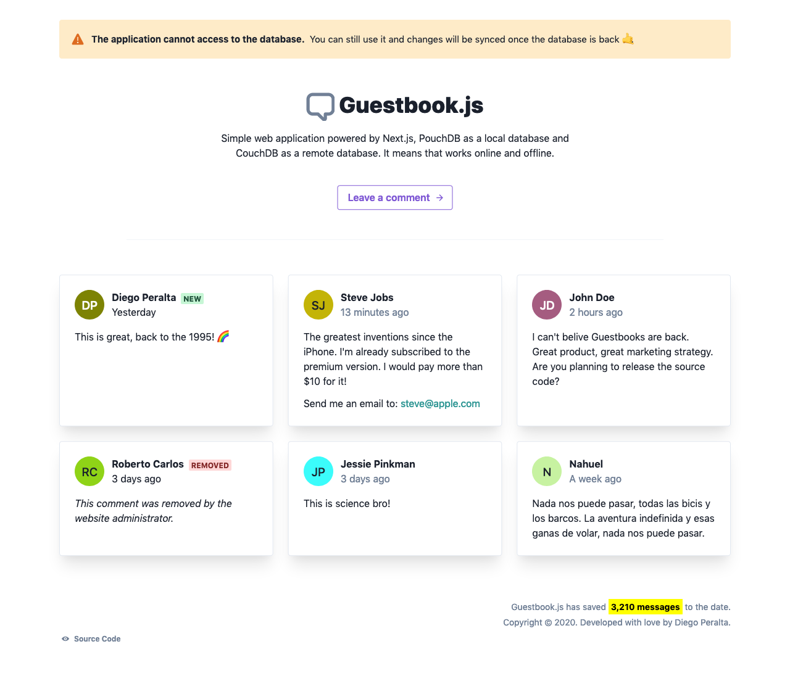

## COVID-19 Stats

Another website showing real-time worldwide stats about coronavirus.

[Website](//covid19.diego.earth/) | [Github](//github.com/spacecowb0y/covid19-stats)

----

## Guestbook.js (WIP)

Simple web application powered by Next.js, PouchDB as a local database and CouchDB as a remote database. It means that works online and offline.

[Website](//guestbookjs.now.sh) | [Github](//github.com/spacecowb0y/nextjs-pouchdb-guestbook)
